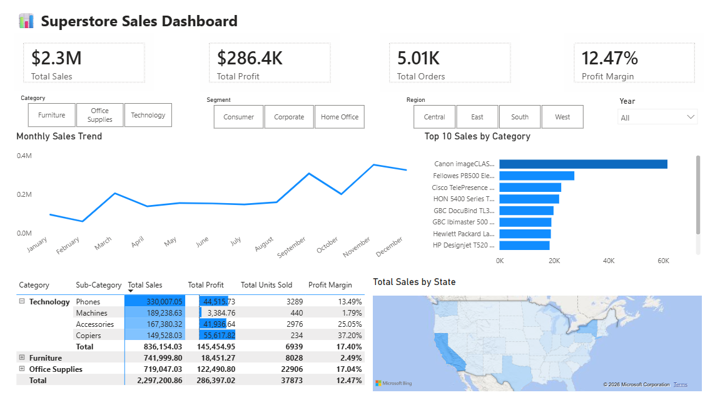

# Superstore Sales Dashboard — Power BI



---

## 📌 Project Overview

A Power BI dashboard analyzing sales, profit, and product performance for a retail superstore. This project demonstrates end-to-end data analytics skills - from data transformation to building an interactive executive dashboard.

**Business Questions Answered:**
- What are the monthly sales trends?
- Which categories are the most profitable?
- Who are the top-performing products?
- How do sales vary by region and customer segment?
- What is the profit margin breakdown by category?

---

## 🛠️ Tech Stack

| Tool | Purpose |
| :--- | :--- |
| **Power BI Desktop** | Data visualization & dashboard creation |
| **Power Query** | ETL & data transformation |
| **Star Schema** | Data modeling (Fact & Dimension tables) |
| **DAX** | Measures & calculated columns |
| **Git / GitHub** | Version control & portfolio hosting |

---

## 📊 Key Insights

| Metric | Value |
| :--- | :--- |
| **Total Revenue** | $2.3M |
| **Total Profit** | $286.4K |
| **Total Orders** | 5.01K |
| **Profit Margin** | 12.47% |
| **Top Category** | Technology (highest sales) |
| **Top Product** | Canon imageCLASS |

---

## 🔍 Dashboard Features

### 1. KPI Cards
- Total Sales ($2.3M)
- Total Profit ($286.4K)
- Total Orders (5.01K)
- Profit Margin (12.47%)

### 2. Interactive Slicers
- Category (Furniture, Office Supplies, Technology)
- Segment (Consumer, Corporate, Home Office)
- Region (Central, East, South, West)
- Year (2014–2017)

### 3. Visualizations
- **Monthly Sales Trend** (Line Chart)
- **Top 10 Products by Sales** (Bar Chart)
- **Sales by State** (Filled Map)
- **Category → Sub-Category Matrix** (Sales, Profit, Units, Margin)

---
## 📂 Repository Structure
```
power-bi-superstore-dashboard/
│
├── data/
│   └── train.csv
├── images/
│   └── dashboard_preview.png
├── report/
│   └── Superstore_Dashboard.pbix
├── README.md
└── .gitignore
```
---
## 📂 Data Source

- **Dataset:** Kaggle Superstore Sales Dataset (2014–2017)
- **File:** `data/train.csv`
- **Rows:** 10,000+ transactions
- **Columns:** 18 (Order ID, Customer, Product, Sales, Profit, Discount, etc.)

---

## 🚀 How to Run Locally

1. Clone this repository
   ```bash
   git clone https://github.com/awaliahftr/power-bi-superstore-dashboard.git
2. Open the Power BI file
```
   report/Superstore_Dashboard.pbix
```
3. Ensure data source path points to data/train.csv
4. Refresh data (if needed)

## 📈 Future Improvements
- Add forecasting with Power BI's built-in forecasting tool
- Implement drill-through pages for product-level detail
- Add what-if parameters for discount simulation
- Publish to Power BI Service for public access

📫 Connect with Me
LinkedIn
GitHub
